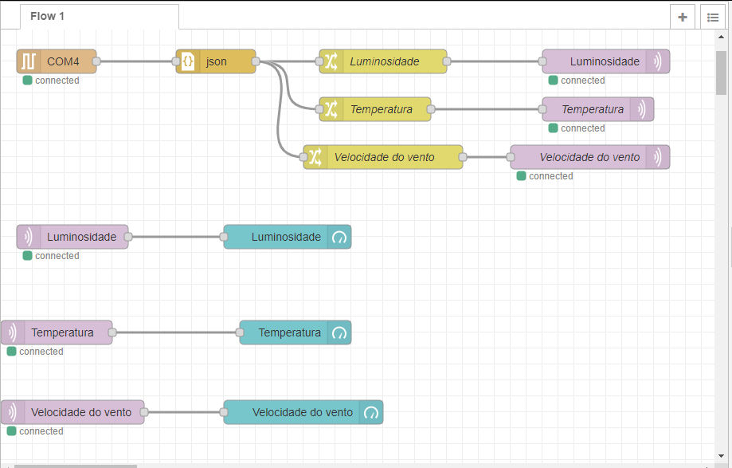

# Projeto de estação meteorológica 

**Nome dos alunos:**
<ul>
	<li>João Paulo Pereira Macêdo</li>
	<li>Karen Martins Silveira</li>
	<li>Lucas Pelosi de Almeida</li>
	<li>Mariana Alves de Oliveira Ribeiro</li>
	<li>Tiago de Brito Ferreira</li>
	<li>Vitor Mendes Olivério</li>
</ul>                    

**Turma:**
2TDSG

**Ano:**
2021

## Objetivo / descrição do Projeto

O projeto foi desenvolvido para a matéria de Disruptive Architectures IOT and IA, do curso de Análise e Desenvolvimento de Sistemas da FIAP.

O intuito do projeto é uma aplicação IoT de estação meteorológica desenvolvido para Smart Cities, na qual faz a coleta de informações por meio de sensores e faz o envio via serial para um um fluxo no node-red que publica nos tópicos de cada sensor via MQTT e exibe em um dashboard, caso a velocidade do vento seja maior que 80Km/h é enviado um alerta via twitter.
 

<b>Dispositivos IoT utilizados:</b>
<ul>
	<li>Arduino Uno</li>
	<li>Fotoresistor LDR: mede a intensidade da luz</li>
	<li>Sensor de temperatura TMP: mede a temperatura</li>
	<li>Frequencímetro: mede a frequência de voltas por segundo</li>
</ul>

## Sotware e plataforma necessários
<ul>
	<li>SimulIDE</li>
	<li>Node-red</li>
</ul>

## Como instalar e configurar 

Explique como rodar o seu projeto. Quais programas instalar, como configurar... 
<b>Passos para utilizar o SimulIDE:</b>
<ol>
<li>Faça o download</li>
	
	https://www.simulide.com/p/downloads.html
<li>Descompacte o arquivo zip</li>
<li>O aplicativo estará na pasta bin</li>
</ol>

<b>Passos para utilizar o Node-red:</b>
<ol>
<li>É necessário a instalação do node.js LTS</li>
	
	https://nodejs.org/en/
<li>Abra o cmd e digite:</li>
	
	npm install -g --unsafe-perm node-red
<li>Para acessar o servidor, acesso no seu browser:</li>
	
	http://localhost:1880
	
</ol>

## Arquitetura do projeto

<h3>Fluxo do Node-Red </h3>

<figcaption>A COM4 está recendendo a conexão serial da COM3 que foi aberta no serial do Arudino dentro do SimulIde</figcaption>

O nó JSON está recebendo o arquivo JSON gerado pelo código do Arduino

Nó Change/Set está recebendo o msg.payload e está filtrando e enviando as informações para o MQTT

MQTT OUT vai receber a mensagem filtrada e vai publicar as mensagens com o contéudo

O MQTT IN está conectado com o MQTT OUT e faz o envio no dashboard

<ul>
	<li>Luminosidade</li>
	<li>Temperatura</li>
	<li>Velocidade do vento</li>
</ul>
<ul>
	<li>node-red-dashboard</li>
	<li>node-red-node-serialport</li>
</ul>

Pode adicionar algum trecho de código, por exemplo para clonar esse repositório:

    cd /home/iot
    git clone https://github.com/arnaldojr/templatenac
    cd templatenac
    ls
    

## Link de vídeo demonstração

Adicione o link para assistir ao vídeo do projeto funcionando.

[Link para o video youtube](https://www.youtube.com/watch?v=xva71wynxS0)

### Referências 

* [Node-red](https://nodered.org/docs/getting-started/local)
* [SimulIDE](https://www.simulide.com/index.html)
